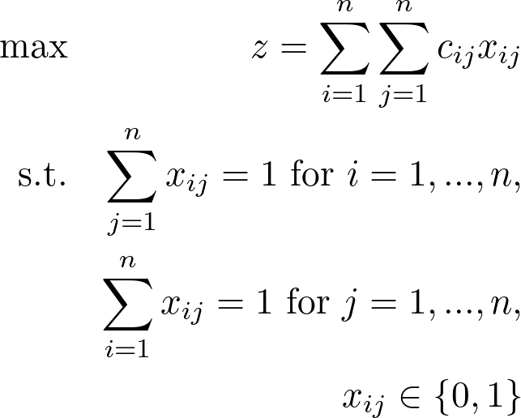
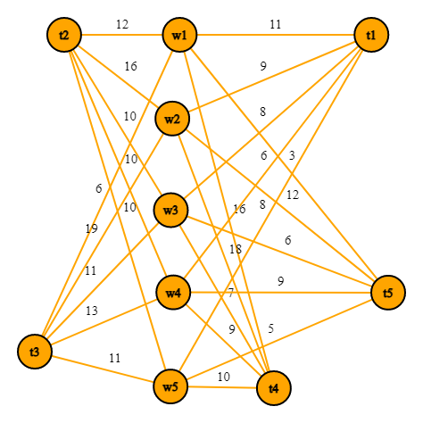
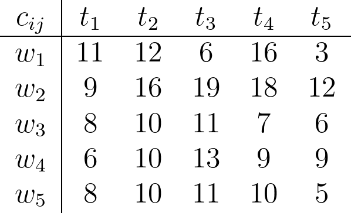

## Assignment Problem
The Assignment Problem is an optimization problem which can be modelled with a linear program. You have ```n``` workers and ```n``` tasks. Every worker can perform each task but for a different cost ```c```. The constraint is that one worker can only perform one task and one task can only be performed by one worker. Never are there more workers performing the same task and vice versa. 
You now want to assign every worker to a different task with the objective of minimizing the cost.

A different interpretation would be instead of cost you have a preference for the tasks and you want to maximize the satisfaction of the workers but here I implemented the former case.

## Linear Program
The variable ```x[i,j]``` is either 0 or 1 for worker ```i``` doing task ```j```. You want to minimize the cost which is the sum of the variables ```x``` multiplied by the cost ```c```. Since you have a one-to-one relationship between workers and tasks there can only be one variable ```x``` per worker but also per tasks to be set to 1. If you imagine ```x``` to be a matrix the sum of elements in every row has to be 1 meaning every worker only gets assigned to one task and the sum in every column also has to be 1 meaning that every task must only be performed by one worker.



## Graph
This problem can be visualized in a graph with ```2n``` vertices and ```n^2``` edges with weights. Here is an absolutely great (no it's not) example which is very easy (stop now) to grasp.



There are 5 workers who all have 5 edges connecting themselves to a different task with costs associated to it. Notice that the workers themselves are not connected and neither are the tasks. This property makes this a bipartite graph.

A better way to showcase this problem is by using a table or matrix.



Here you can clearly see that worker 1 does task 3 with the cost of 6. This matrix is in the Julia program I have written and can be changed to fit your problem.

## Solution
You can obtain solutions by modelling it like I have done and using a solver. Eventough you want binary variables there is no need to specify this because every solution to this problem will have binary variables. 

There is a harder way which is to program the Hungarian Algorithm that solves this problem with the complexity ```O(n^3)```. 

Here is the result to the example showcased above:

```
Worker  Task    Cost
 1       3       6
 2       1       9
 3       4       7
 4       2       10
 5       5       5
----------------------
Total Cost: 37.0
```
